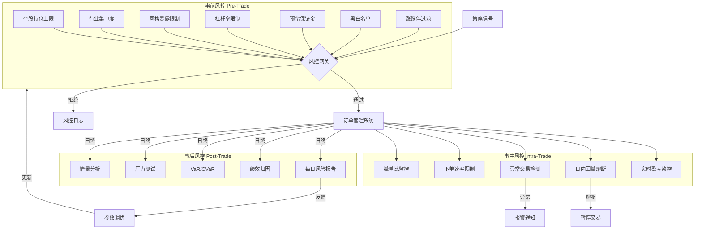
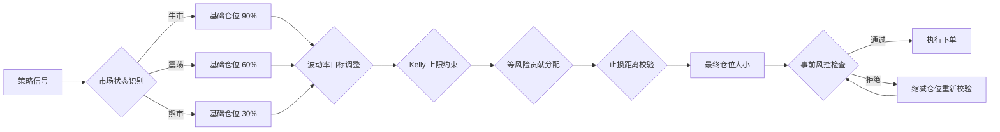

# 量化交易风控体系建设

## 核心要点

| 维度 | 关键内容 | 核心目标 |
|------|----------|----------|
| **事前风控** | 持仓上限/行业集中度/风格暴露/杠杆率/保证金/黑白名单/涨跌停过滤 | 从源头阻断不合规委托 |
| **事中风控** | 实时盈亏/日内回撤熔断/异常交易检测/下单速率/撤单比 | 交易过程实时干预 |
| **事后风控** | 风险报告/绩效归因/VaR&CVaR/压力测试/情景分析 | 复盘评估与制度迭代 |
| **仓位管理** | Kelly/固定比例/等风险贡献/波动率目标/动态调仓 | 科学分配资金与风险预算 |
| **止损策略** | 固定止损/追踪止损/波动率自适应/ATR止损/组合止损 | 控制单笔及组合层面亏损 |

> [!tip] 风控的核心原则
> 风控不是利润的对立面，而是长期存活的基础。量化交易中 **"先生存、再盈利"** 是铁律。一套完整的风控体系应覆盖事前-事中-事后三层，并与仓位管理和止损策略紧密耦合。

---

## 一、事前风控（Pre-Trade Risk Control）

事前风控在委托下达前进行规则校验，是风控体系的第一道防线。所有买卖指令必须通过以下 7 项检查后方可提交至交易所。

### 1.1 个股持仓上限

**目标**：防止单只股票过度集中，降低个股"黑天鹅"冲击。

| 参数 | 典型阈值 | 说明 |
|------|----------|------|
| 单股持仓占比上限 | 总资产的 5%~10% | 公募基金"双十限制"要求单股不超 10% |
| 单股最大持仓金额 | 500 万元 | 绝对值硬限制 |
| 单股最大持仓股数 | 50,000 股 | 防止小盘股流动性风险 |

```python
def check_single_stock_limit(symbol: str, order_value: float,
                              current_positions: dict, total_nav: float,
                              max_pct: float = 0.10, max_abs: float = 5_000_000) -> tuple[bool, str]:
    """个股持仓上限检查"""
    current_value = current_positions.get(symbol, 0)
    new_value = current_value + order_value
    # 比例限制
    if new_value / total_nav > max_pct:
        return False, f"{symbol} 持仓占比 {new_value/total_nav:.1%} 超过上限 {max_pct:.0%}"
    # 绝对值限制
    if new_value > max_abs:
        return False, f"{symbol} 持仓金额 {new_value:,.0f} 超过上限 {max_abs:,.0f}"
    return True, "通过"
```

### 1.2 行业集中度限制

**目标**：避免组合在单一行业暴露过大，参考 [[组合优化与资产配置]] 中行业中性约束。

| 参数 | 典型阈值 | 说明 |
|------|----------|------|
| 单行业持仓上限 | 总资产的 15%~25% | 相对基准偏离不超 ±5% |
| 前三大行业合计上限 | 总资产的 50% | 防止行业"抱团" |

```python
def check_industry_concentration(order_industry: str, order_value: float,
                                  industry_positions: dict, total_nav: float,
                                  max_single: float = 0.20, max_top3: float = 0.50) -> tuple[bool, str]:
    """行业集中度检查"""
    updated = industry_positions.copy()
    updated[order_industry] = updated.get(order_industry, 0) + order_value
    # 单行业上限
    if updated[order_industry] / total_nav > max_single:
        return False, f"行业 {order_industry} 占比超限 {max_single:.0%}"
    # 前三大行业上限
    top3 = sum(sorted(updated.values(), reverse=True)[:3])
    if top3 / total_nav > max_top3:
        return False, f"前三大行业合计 {top3/total_nav:.1%} 超限 {max_top3:.0%}"
    return True, "通过"
```

### 1.3 风格暴露限制

**目标**：控制市值、价值/成长、动量等风格因子的偏离度，避免策略在某一风格上"赌方向"。参考 [[多因子模型构建实战]] 中风格因子定义。

| 风格因子 | 暴露上限（相对基准） | 说明 |
|----------|----------------------|------|
| 市值（Size） | ±0.5 标准差 | 防止过度偏向大/小盘 |
| 价值（Value） | ±0.3 标准差 | 控制 BP/EP 暴露 |
| 动量（Momentum） | ±0.5 标准差 | 避免追涨杀跌 |
| 波动率（Volatility） | ±0.3 标准差 | 控制低波/高波偏离 |

```python
import numpy as np

def check_style_exposure(portfolio_weights: np.ndarray, factor_loadings: np.ndarray,
                          benchmark_exposure: np.ndarray,
                          max_deviation: np.ndarray) -> tuple[bool, str]:
    """风格暴露检查
    factor_loadings: (n_stocks, n_factors) 因子载荷矩阵
    """
    port_exposure = portfolio_weights @ factor_loadings  # (n_factors,)
    deviation = port_exposure - benchmark_exposure
    violations = np.abs(deviation) > max_deviation
    if violations.any():
        factor_names = ['Size', 'Value', 'Momentum', 'Volatility']
        violated = [factor_names[i] for i in range(len(violations)) if violations[i]]
        return False, f"风格暴露超限: {', '.join(violated)}"
    return True, "通过"
```

### 1.4 杠杆率限制

**目标**：控制总杠杆水平，防止过度借贷放大风险。

| 参数 | 典型阈值 | 说明 |
|------|----------|------|
| 最大总杠杆 | 1.0（无杠杆）~1.6 | 融资融券最高 1:1，即总杠杆 2.0 |
| 净多头暴露上限 | 100% | 多头 - 空头 ≤ 净资产 |
| 总暴露上限（多空之和） | 200% | 130/70 多空策略常见 |

```python
def check_leverage(long_value: float, short_value: float, nav: float,
                    max_gross: float = 2.0, max_net: float = 1.0) -> tuple[bool, str]:
    """杠杆率检查"""
    gross_leverage = (long_value + abs(short_value)) / nav
    net_leverage = (long_value - abs(short_value)) / nav
    if gross_leverage > max_gross:
        return False, f"总杠杆 {gross_leverage:.2f} 超限 {max_gross}"
    if abs(net_leverage) > max_net:
        return False, f"净杠杆 {net_leverage:.2f} 超限 ±{max_net}"
    return True, "通过"
```

### 1.5 预留保证金

**目标**：确保账户始终保有足够可用资金，防止被强制平仓。参考 [[A股量化实盘接入方案]] 中保证金管理。

```python
def check_margin_reserve(available_cash: float, order_value: float,
                          margin_ratio: float = 1.0,
                          reserve_ratio: float = 0.10,
                          total_nav: float = 0) -> tuple[bool, str]:
    """预留保证金检查
    reserve_ratio: 账户至少保留的可用资金占比
    """
    required_margin = order_value * margin_ratio
    min_reserve = total_nav * reserve_ratio
    if available_cash - required_margin < min_reserve:
        return False, f"可用资金不足, 下单后仅剩 {available_cash - required_margin:,.0f} < 预留 {min_reserve:,.0f}"
    return True, "通过"
```

### 1.6 黑名单 / 白名单

**目标**：屏蔽问题股票（ST、*ST、退市整理、财务造假等），或限定策略仅交易白名单标的。

| 类型 | 典型规则 | 数据来源 |
|------|----------|----------|
| 黑名单 | ST/*ST、停牌、退市整理、近期被监管处罚 | 交易所公告 + Wind/Choice |
| 白名单 | 沪深 300 成分股 / 中证 500 成分股 | 指数成分列表 |
| 限制名单 | 内幕信息相关、关联交易限制 | 合规部门提供 |

```python
class StockFilter:
    def __init__(self, blacklist: set = None, whitelist: set = None):
        self.blacklist = blacklist or set()
        self.whitelist = whitelist  # None 表示不启用白名单

    def check(self, symbol: str) -> tuple[bool, str]:
        if symbol in self.blacklist:
            return False, f"{symbol} 在黑名单中"
        if self.whitelist is not None and symbol not in self.whitelist:
            return False, f"{symbol} 不在白名单中"
        return True, "通过"
```

### 1.7 涨跌停 / 限价单过滤

**目标**：避免以涨停价买入（流动性极差、大概率无法成交或次日回调）或以跌停价卖出（加剧亏损）。参考 [[A股交易制度全解析]] 中涨跌停制度。

| 规则 | 说明 |
|------|------|
| 涨停板不买 | 当前价 ≥ 涨停价 × 99.5%，禁止买入 |
| 跌停板不卖 | 当前价 ≤ 跌停价 × 100.5%，禁止卖出（除非止损平仓） |
| 新股上市首日 | 前 5 日无涨跌停（注册制），不纳入策略池 |
| 限价单价格偏离 | 委托价偏离最新价超过 2% 需人工确认 |

```python
def check_price_limit(symbol: str, order_price: float, order_side: str,
                       current_price: float, upper_limit: float, lower_limit: float,
                       price_deviation_max: float = 0.02) -> tuple[bool, str]:
    """涨跌停及限价单过滤"""
    # 涨停不买
    if order_side == 'BUY' and current_price >= upper_limit * 0.995:
        return False, f"{symbol} 触及涨停, 禁止买入"
    # 跌停不卖
    if order_side == 'SELL' and current_price <= lower_limit * 1.005:
        return False, f"{symbol} 触及跌停, 禁止卖出"
    # 价格偏离检查
    deviation = abs(order_price - current_price) / current_price
    if deviation > price_deviation_max:
        return False, f"{symbol} 委托价偏离 {deviation:.1%} 超限 {price_deviation_max:.0%}"
    return True, "通过"
```

---

## 二、事中风控（Intra-Trade Risk Control）

事中风控在交易执行过程中实时监控，发现异常立即干预（报警、限速、熔断平仓）。

### 2.1 实时盈亏监控

**目标**：跟踪账户及个股的浮动盈亏，触发预警或平仓。

| 指标 | 预警阈值 | 熔断阈值 | 动作 |
|------|----------|----------|------|
| 账户日内浮亏 | -2% | -5% | 预警 → 禁止新开仓 |
| 单股浮亏 | -5% | -10% | 预警 → 强制减仓 |
| 账户日内浮盈回撤 | -30%（从日内峰值） | -50% | 逐步减仓 → 清仓 |

```python
class RealTimePnLMonitor:
    def __init__(self, initial_nav: float, warn_loss: float = -0.02,
                 circuit_breaker_loss: float = -0.05):
        self.initial_nav = initial_nav
        self.peak_nav = initial_nav
        self.warn_loss = warn_loss
        self.circuit_breaker_loss = circuit_breaker_loss
        self.is_frozen = False

    def update(self, current_nav: float) -> dict:
        self.peak_nav = max(self.peak_nav, current_nav)
        daily_pnl = (current_nav - self.initial_nav) / self.initial_nav
        drawdown_from_peak = (current_nav - self.peak_nav) / self.peak_nav

        status = "NORMAL"
        if daily_pnl <= self.circuit_breaker_loss:
            status = "CIRCUIT_BREAKER"
            self.is_frozen = True  # 熔断：禁止一切交易
        elif daily_pnl <= self.warn_loss:
            status = "WARNING"

        return {
            "daily_pnl": daily_pnl,
            "drawdown_from_peak": drawdown_from_peak,
            "status": status,
            "is_frozen": self.is_frozen,
        }
```

### 2.2 最大日内回撤熔断

**目标**：当日内回撤达到阈值时，自动触发"熔断"——平掉所有头寸或禁止新开仓。

```python
class IntradayDrawdownBreaker:
    """日内回撤熔断器"""
    def __init__(self, max_drawdown_pct: float = 0.03, cooldown_minutes: int = 30):
        self.max_drawdown_pct = max_drawdown_pct
        self.cooldown_minutes = cooldown_minutes
        self.high_watermark = 0
        self.breaker_triggered = False
        self.trigger_time = None

    def on_tick(self, current_nav: float, timestamp) -> str:
        self.high_watermark = max(self.high_watermark, current_nav)
        dd = (current_nav - self.high_watermark) / self.high_watermark

        if dd < -self.max_drawdown_pct and not self.breaker_triggered:
            self.breaker_triggered = True
            self.trigger_time = timestamp
            return "HALT"  # 触发熔断, 停止交易

        # 冷却期后可恢复（可选）
        if self.breaker_triggered and self.trigger_time:
            elapsed = (timestamp - self.trigger_time).total_seconds() / 60
            if elapsed > self.cooldown_minutes:
                self.breaker_triggered = False
                return "RESUME"

        return "HALTED" if self.breaker_triggered else "NORMAL"
```

### 2.3 异常交易检测

**目标**：识别策略 bug 或市场异常导致的不正常交易行为。根据 2025-2026 年沪深北交易所《程序化交易管理实施细则》，以下行为受严格监管：

| 异常类型 | 监管阈值（2026年4月新规） | 检测逻辑 |
|----------|---------------------------|----------|
| 瞬时申报速率 | 单账户 ≥15 笔/秒（高频认定） | 滑动窗口计数 |
| 频繁瞬时撤单 | 1分钟撤单率 >80% | 撤单数/委托数 |
| 频繁拉抬打压 | 短时间单向大额委托 | 成交方向集中度 |
| 短时间大额成交 | 单日申报+撤单 ≥20,000 笔 | 日累计计数 |

> [!warning] 监管红线
> 2026年4月新规将高频交易阈值降至每秒15笔，报单停留时间 ≥50微秒，撤单率上限15%/日。违规参照操纵市场从重处罚，严重者市场禁入。

```python
import time
from collections import deque

class AbnormalTradeDetector:
    """异常交易检测器（符合2026年监管要求）"""
    def __init__(self, max_orders_per_sec: int = 10,  # 内部限制远低于监管红线15
                 max_cancel_ratio: float = 0.10,       # 内部限制远低于监管红线15%
                 max_daily_orders: int = 15000):        # 远低于20000
        self.max_orders_per_sec = max_orders_per_sec
        self.max_cancel_ratio = max_cancel_ratio
        self.max_daily_orders = max_daily_orders
        self.order_timestamps = deque()
        self.daily_order_count = 0
        self.daily_cancel_count = 0

    def check_order_rate(self) -> tuple[bool, str]:
        """下单速率检查"""
        now = time.time()
        self.order_timestamps.append(now)
        # 清除1秒前的记录
        while self.order_timestamps and self.order_timestamps[0] < now - 1.0:
            self.order_timestamps.popleft()
        if len(self.order_timestamps) > self.max_orders_per_sec:
            return False, f"下单速率 {len(self.order_timestamps)}/秒 超限"
        return True, "通过"

    def check_cancel_ratio(self) -> tuple[bool, str]:
        """撤单比检查"""
        if self.daily_order_count == 0:
            return True, "通过"
        ratio = self.daily_cancel_count / self.daily_order_count
        if ratio > self.max_cancel_ratio:
            return False, f"撤单比 {ratio:.1%} 超限 {self.max_cancel_ratio:.0%}"
        return True, "通过"

    def on_order(self):
        self.daily_order_count += 1
        return self.check_order_rate()

    def on_cancel(self):
        self.daily_cancel_count += 1
        return self.check_cancel_ratio()

    def check_daily_limit(self) -> tuple[bool, str]:
        if self.daily_order_count >= self.max_daily_orders:
            return False, f"日累计委托 {self.daily_order_count} 达上限"
        return True, "通过"
```

### 2.4 下单速率限制

**目标**：防止程序 bug 导致"下单风暴"，同时满足监管合规。

```python
import asyncio
from collections import deque

class OrderRateLimiter:
    """令牌桶限速器"""
    def __init__(self, max_per_second: int = 8, max_per_minute: int = 200):
        self.max_per_second = max_per_second
        self.max_per_minute = max_per_minute
        self._second_window = deque()
        self._minute_window = deque()

    def acquire(self) -> bool:
        now = time.time()
        # 清理过期记录
        while self._second_window and self._second_window[0] < now - 1:
            self._second_window.popleft()
        while self._minute_window and self._minute_window[0] < now - 60:
            self._minute_window.popleft()
        # 检查限速
        if len(self._second_window) >= self.max_per_second:
            return False
        if len(self._minute_window) >= self.max_per_minute:
            return False
        self._second_window.append(now)
        self._minute_window.append(now)
        return True
```

### 2.5 撤单比监控

**目标**：持续监控撤单/委托比例，在接近监管红线前主动降速。

```python
class CancelRatioMonitor:
    """撤单比实时监控"""
    def __init__(self, warn_ratio: float = 0.08, halt_ratio: float = 0.12,
                 regulatory_limit: float = 0.15):
        self.warn_ratio = warn_ratio
        self.halt_ratio = halt_ratio
        self.regulatory_limit = regulatory_limit
        self.total_orders = 0
        self.total_cancels = 0

    def record_order(self):
        self.total_orders += 1

    def record_cancel(self):
        self.total_cancels += 1

    def get_status(self) -> dict:
        ratio = self.total_cancels / max(self.total_orders, 1)
        if ratio >= self.halt_ratio:
            level = "HALT"
        elif ratio >= self.warn_ratio:
            level = "WARNING"
        else:
            level = "NORMAL"
        return {
            "cancel_ratio": ratio,
            "level": level,
            "total_orders": self.total_orders,
            "total_cancels": self.total_cancels,
            "distance_to_regulatory": self.regulatory_limit - ratio,
        }
```

---

## 三、事后风控（Post-Trade Risk Control）

事后风控在每个交易日结束后进行全面风险评估，生成报告并驱动制度迭代。

### 3.1 每日风险报告

报告应覆盖以下内容，参考 [[策略绩效评估与统计检验]] 中绩效指标体系：

| 模块 | 内容 |
|------|------|
| 损益汇总 | 日收益、累计收益、相对基准超额 |
| 持仓分析 | 个股持仓、行业分布、风格暴露热力图 |
| 风险指标 | VaR、CVaR、波动率、最大回撤、Beta |
| 交易统计 | 委托数、成交数、撤单比、滑点成本 |
| 违规记录 | 触发风控规则的事件及处理结果 |
| 流动性分析 | 各持仓股票成交量占比、冲击成本 |

### 3.2 绩效归因

将组合收益分解为各因子贡献，识别收益来源和风险暴露：

```python
import numpy as np
import pandas as pd

def brinson_attribution(port_weights: np.ndarray, bench_weights: np.ndarray,
                         port_returns: np.ndarray, bench_returns: np.ndarray,
                         sectors: list) -> pd.DataFrame:
    """Brinson 归因分析（行业层面）"""
    allocation = (port_weights - bench_weights) * bench_returns  # 配置效应
    selection = bench_weights * (port_returns - bench_returns)   # 选股效应
    interaction = (port_weights - bench_weights) * (port_returns - bench_returns)  # 交互效应
    return pd.DataFrame({
        'sector': sectors,
        'allocation': allocation,
        'selection': selection,
        'interaction': interaction,
        'total': allocation + selection + interaction,
    })
```

### 3.3 VaR / CVaR 计算（三种方法）

VaR（Value at Risk）衡量在给定置信水平下的最大预期损失；CVaR（Conditional VaR，又称 Expected Shortfall）衡量损失超过 VaR 时的条件期望损失，更好地捕捉尾部风险。

#### 方法一：历史模拟法（非参数）

直接使用历史收益率分布的分位数，不假设任何分布形态。

$$VaR_\alpha^{HS} = -\text{Percentile}(R, 1-\alpha)$$

$$CVaR_\alpha^{HS} = -\mathbb{E}[R \mid R \le -VaR_\alpha]$$

```python
import numpy as np

def var_cvar_historical(returns: np.ndarray, confidence: float = 0.95) -> dict:
    """历史模拟法计算VaR和CVaR
    returns: 日收益率序列
    confidence: 置信水平
    """
    var = -np.percentile(returns, 100 * (1 - confidence))
    tail_losses = returns[returns <= -var]
    cvar = -np.mean(tail_losses) if len(tail_losses) > 0 else var
    return {"VaR": var, "CVaR": cvar, "method": "historical"}
```

**优点**：无需分布假设，能捕捉非正态特征（尖峰肥尾）。
**缺点**：依赖历史样本量，极端事件样本不足。

#### 方法二：参数法（方差-协方差法）

假设收益率服从正态分布（或 t 分布），利用均值和标准差解析计算。

$$VaR_\alpha^{Param} = -(\mu + \sigma \cdot \Phi^{-1}(1-\alpha))$$

$$CVaR_\alpha^{Param} = -\mu + \sigma \cdot \frac{\phi(\Phi^{-1}(1-\alpha))}{\alpha}$$

```python
from scipy.stats import norm, t as t_dist

def var_cvar_parametric(returns: np.ndarray, confidence: float = 0.95,
                         dist: str = "normal") -> dict:
    """参数法计算VaR和CVaR
    dist: 'normal' 或 'student-t'
    """
    mu, sigma = np.mean(returns), np.std(returns)
    alpha = 1 - confidence

    if dist == "normal":
        var = -(mu + sigma * norm.ppf(alpha))
        cvar = -mu + sigma * norm.pdf(norm.ppf(alpha)) / alpha
    elif dist == "student-t":
        # 拟合t分布自由度
        params = t_dist.fit(returns)
        nu = params[0]
        var = -(mu + sigma * t_dist.ppf(alpha, nu))
        cvar = -mu + sigma * (t_dist.pdf(t_dist.ppf(alpha, nu), nu) / alpha) * \
               (nu + t_dist.ppf(alpha, nu)**2) / (nu - 1)
    else:
        raise ValueError(f"不支持的分布: {dist}")

    return {"VaR": var, "CVaR": cvar, "method": f"parametric_{dist}"}
```

**优点**：计算快速，适合大规模组合。
**缺点**：正态假设不适用于 A 股市场的肥尾特征，t 分布可改善。

#### 方法三：蒙特卡洛模拟法

通过随机模拟大量收益路径，统计 VaR/CVaR。可加入非正态分布、波动率聚集等复杂特征。

```python
def var_cvar_monte_carlo(returns: np.ndarray, confidence: float = 0.95,
                          n_simulations: int = 100_000, holding_days: int = 1) -> dict:
    """蒙特卡洛模拟法计算VaR和CVaR"""
    mu, sigma = np.mean(returns), np.std(returns)

    # 模拟 n 条路径，每条 holding_days 天
    sim_returns = np.random.normal(
        mu * holding_days,
        sigma * np.sqrt(holding_days),
        n_simulations
    )

    var = -np.percentile(sim_returns, 100 * (1 - confidence))
    tail = sim_returns[sim_returns <= -var]
    cvar = -np.mean(tail) if len(tail) > 0 else var

    return {"VaR": var, "CVaR": cvar, "method": "monte_carlo",
            "n_simulations": n_simulations}
```

**优点**：灵活性最高，可模拟任意分布和路径依赖。
**缺点**：计算密集，需要足够模拟次数（建议 ≥100,000）。

#### 三种方法对比

| 维度 | 历史模拟法 | 参数法 | 蒙特卡洛法 |
|------|-----------|--------|-----------|
| 分布假设 | 无 | 正态/t | 可自定义 |
| 计算速度 | 快 | 最快 | 慢 |
| 尾部风险 | 取决于样本 | 偏低（正态） | 可自定义 |
| 适用场景 | 数据充分时 | 快速估算 | 复杂组合/衍生品 |
| A股适用性 | 推荐 | 建议用t分布 | 含期权时推荐 |

### 3.4 压力测试与情景分析

**压力测试**：模拟极端市场环境下组合的损失。参考 [[A股衍生品市场与对冲工具]] 中尾部风险对冲。

| 情景类型 | 具体场景 | 冲击参数 |
|----------|----------|----------|
| 历史情景 | 2015 年股灾 | 沪深 300 连跌 7 天，累计 -32% |
| 历史情景 | 2020 年疫情 | 单日 -8%，周跌 -12% |
| 历史情景 | 2018 年贸易战 | 持续 6 个月，累计 -25% |
| 假设情景-轻度 | 市场普跌 | 全行业 -5%，波动率 ×1.5 |
| 假设情景-中度 | 流动性枯竭 | 成交量缩减 70%，滑点 ×3 |
| 假设情景-重度 | 黑天鹅事件 | 单日 -15%，流动性完全丧失 |

```python
import pandas as pd
import numpy as np

class StressTester:
    """压力测试与情景分析引擎"""

    # 预定义历史情景
    HISTORICAL_SCENARIOS = {
        "2015_crash": {"daily_return": -0.07, "duration_days": 7, "vol_multiplier": 3.0},
        "2020_covid":  {"daily_return": -0.08, "duration_days": 5, "vol_multiplier": 2.5},
        "2018_trade_war": {"daily_return": -0.015, "duration_days": 120, "vol_multiplier": 1.8},
    }

    def __init__(self, portfolio_value: float, positions: dict):
        self.portfolio_value = portfolio_value
        self.positions = positions  # {symbol: value}

    def apply_scenario(self, scenario: dict) -> dict:
        """应用单一情景"""
        daily_ret = scenario["daily_return"]
        days = scenario["duration_days"]
        cumulative_return = (1 + daily_ret) ** days - 1
        loss = self.portfolio_value * cumulative_return
        return {
            "cumulative_return": cumulative_return,
            "portfolio_loss": loss,
            "remaining_value": self.portfolio_value + loss,
            "survival": (self.portfolio_value + loss) > 0,
        }

    def run_all_historical(self) -> pd.DataFrame:
        """运行所有历史情景"""
        results = []
        for name, scenario in self.HISTORICAL_SCENARIOS.items():
            result = self.apply_scenario(scenario)
            result["scenario"] = name
            results.append(result)
        return pd.DataFrame(results)

    def monte_carlo_stress(self, mu: float, sigma: float,
                            shock_factor: float = 3.0,
                            n_sim: int = 10000) -> dict:
        """蒙特卡洛压力测试"""
        stressed_returns = np.random.normal(mu, sigma * shock_factor, n_sim)
        losses = self.portfolio_value * stressed_returns
        return {
            "mean_loss": np.mean(losses),
            "worst_5pct": np.percentile(losses, 5),
            "worst_1pct": np.percentile(losses, 1),
            "probability_of_ruin": np.mean(losses < -self.portfolio_value * 0.5),
        }
```

### 3.5 风险指标追踪

| 指标 | 公式/说明 | 频率 | 预警阈值 |
|------|-----------|------|----------|
| 年化波动率 | $\sigma_{ann} = \sigma_{daily} \times \sqrt{252}$ | 日 | > 25% |
| 最大回撤 | 从峰值到谷值的最大跌幅 | 日 | > 15% |
| Sharpe Ratio | $(R_p - R_f) / \sigma_p$ | 周 | < 0.5 |
| Calmar Ratio | 年化收益 / 最大回撤 | 月 | < 1.0 |
| Beta | $\text{Cov}(R_p, R_m) / \text{Var}(R_m)$ | 日 | > 1.2 |
| 跟踪误差 | $\text{std}(R_p - R_b)$ | 日 | > 8% |

---

## 四、仓位管理策略

仓位管理决定了"投多少钱"，是风险管理中与收益最直接相关的环节。参考 [[组合优化与资产配置]] 中资金分配方法。

### 4.1 Kelly 公式（Kelly Criterion）

**核心思想**：最大化长期复合增长率的最优仓位比例。

$$f^* = \frac{p \cdot b - (1-p)}{b} = p - \frac{1-p}{b}$$

其中 $p$ 为胜率，$b$ 为盈亏比（平均盈利/平均亏损）。

**实践中使用半凯利（Half-Kelly）**：$f_{actual} = f^* / 2$，降低波动、提高容错。

```python
import numpy as np
import pandas as pd

def kelly_fraction(returns: pd.Series, half_kelly: bool = True,
                    max_fraction: float = 0.25) -> dict:
    """计算Kelly最优仓位比例
    returns: 策略历史收益率序列
    """
    wins = returns[returns > 0]
    losses = returns[returns < 0]

    if len(wins) == 0 or len(losses) == 0:
        return {"kelly_f": 0, "recommended_f": 0}

    win_rate = len(wins) / len(returns)
    avg_win = wins.mean()
    avg_loss = abs(losses.mean())
    win_loss_ratio = avg_win / avg_loss  # 盈亏比 b

    kelly_f = win_rate - (1 - win_rate) / win_loss_ratio

    # 半凯利 + 上限
    recommended_f = kelly_f / 2 if half_kelly else kelly_f
    recommended_f = np.clip(recommended_f, 0, max_fraction)

    return {
        "win_rate": win_rate,
        "win_loss_ratio": win_loss_ratio,
        "kelly_f": kelly_f,
        "recommended_f": recommended_f,
    }
```

> [!caution] Kelly 公式使用注意
> - 参数估计误差会导致仓位偏大，**务必使用半凯利**
> - 不适用于厚尾分布严重的 A 股市场，建议结合波动率目标
> - 胜率和盈亏比应使用样本外数据估计

### 4.2 固定比例法（Fixed Fractional）

每笔交易固定风险金额不超过总资产的 X%。

$$\text{Position Size} = \frac{\text{NAV} \times \text{Risk\%}}{\text{Stop Distance}}$$

```python
def fixed_fractional_size(nav: float, risk_per_trade: float,
                           entry_price: float, stop_price: float) -> dict:
    """固定比例仓位计算
    risk_per_trade: 单笔风险占总资产比例, 通常 1%-2%
    """
    risk_amount = nav * risk_per_trade
    stop_distance = abs(entry_price - stop_price)
    if stop_distance == 0:
        return {"shares": 0, "position_value": 0}

    shares = int(risk_amount / stop_distance)
    # A股必须100股整数倍
    shares = (shares // 100) * 100
    position_value = shares * entry_price

    return {
        "shares": shares,
        "position_value": position_value,
        "risk_amount": risk_amount,
        "position_pct": position_value / nav,
    }
```

### 4.3 等风险贡献法（Equal Risk Contribution / Risk Parity）

每个资产对组合总风险的贡献相等。参考 [[组合优化与资产配置]] 中风险平价模型。

$$w_i \cdot (\Sigma w)_i = \frac{\sigma_p^2}{N}, \quad \forall i$$

```python
import numpy as np
from scipy.optimize import minimize

def equal_risk_contribution(cov_matrix: np.ndarray,
                             target_risk: float = None) -> dict:
    """等风险贡献权重优化"""
    n = cov_matrix.shape[0]

    def risk_contribution(w):
        port_var = w @ cov_matrix @ w
        marginal_contrib = cov_matrix @ w
        risk_contrib = w * marginal_contrib / np.sqrt(port_var)
        return risk_contrib

    def objective(w):
        rc = risk_contribution(w)
        target_rc = np.sqrt(w @ cov_matrix @ w) / n
        return np.sum((rc - target_rc) ** 2)

    # 约束：权重之和=1，权重非负
    constraints = [{"type": "eq", "fun": lambda w: np.sum(w) - 1}]
    bounds = [(0.01, 0.5)] * n  # 每个资产 1%-50%
    w0 = np.ones(n) / n

    result = minimize(objective, w0, method="SLSQP",
                      bounds=bounds, constraints=constraints)
    weights = result.x

    # 缩放到目标风险
    if target_risk is not None:
        port_vol = np.sqrt(weights @ cov_matrix @ weights)
        weights *= target_risk / port_vol

    rc = risk_contribution(weights)

    return {
        "weights": weights,
        "risk_contributions": rc,
        "portfolio_vol": np.sqrt(weights @ cov_matrix @ weights),
    }
```

### 4.4 波动率目标法（Volatility Targeting）

根据实现波动率动态调整仓位，使组合波动率维持在目标水平。

$$w_t = \frac{\sigma_{target}}{\hat{\sigma}_t}$$

其中 $\hat{\sigma}_t$ 为滚动窗口估计的实现波动率。

```python
class VolatilityTargeting:
    """波动率目标仓位管理"""
    def __init__(self, target_vol: float = 0.15, lookback: int = 20,
                 max_leverage: float = 1.5, min_position: float = 0.1,
                 vol_floor: float = 0.05):
        self.target_vol = target_vol
        self.lookback = lookback
        self.max_leverage = max_leverage
        self.min_position = min_position
        self.vol_floor = vol_floor

    def calculate_position(self, returns: pd.Series) -> float:
        """计算目标仓位比例"""
        if len(returns) < self.lookback:
            return self.min_position

        # EWMA波动率（比简单std更灵敏）
        ewma_var = returns.tail(self.lookback).ewm(span=self.lookback).var().iloc[-1]
        realized_vol = np.sqrt(ewma_var * 252)
        realized_vol = max(realized_vol, self.vol_floor)  # 波动率下限

        target_position = self.target_vol / realized_vol
        return np.clip(target_position, self.min_position, self.max_leverage)

    def get_position_series(self, returns: pd.Series) -> pd.Series:
        """计算历史仓位序列"""
        positions = []
        for i in range(len(returns)):
            if i < self.lookback:
                positions.append(self.min_position)
            else:
                pos = self.calculate_position(returns.iloc[:i])
                positions.append(pos)
        return pd.Series(positions, index=returns.index)
```

### 4.5 动态仓位调整（Regime-Based）

根据市场状态（牛市/熊市/震荡）动态切换仓位水平，参考 [[A股市场状态识别与择时因子]]。

```python
class DynamicPositionManager:
    """基于市场状态的动态仓位管理"""
    REGIME_PARAMS = {
        "bull":     {"base_position": 0.90, "vol_target": 0.20},
        "bear":     {"base_position": 0.30, "vol_target": 0.10},
        "sideways": {"base_position": 0.60, "vol_target": 0.15},
    }

    def __init__(self, nav: float):
        self.nav = nav
        self.vol_targeter = VolatilityTargeting()
        self.current_regime = "sideways"

    def detect_regime(self, returns: pd.Series, ma_short: int = 20,
                       ma_long: int = 60) -> str:
        """简易市场状态识别"""
        prices = (1 + returns).cumprod()
        ma_s = prices.rolling(ma_short).mean().iloc[-1]
        ma_l = prices.rolling(ma_long).mean().iloc[-1]
        current = prices.iloc[-1]
        vol = returns.tail(20).std() * np.sqrt(252)

        if current > ma_s > ma_l and vol < 0.25:
            return "bull"
        elif current < ma_s < ma_l or vol > 0.35:
            return "bear"
        else:
            return "sideways"

    def calculate_position(self, returns: pd.Series) -> dict:
        regime = self.detect_regime(returns)
        params = self.REGIME_PARAMS[regime]

        self.vol_targeter.target_vol = params["vol_target"]
        vol_position = self.vol_targeter.calculate_position(returns)

        # 综合仓位 = 状态基础仓位 × 波动率调整
        final_position = min(params["base_position"], vol_position)

        return {
            "regime": regime,
            "base_position": params["base_position"],
            "vol_adjusted_position": vol_position,
            "final_position": final_position,
            "target_value": self.nav * final_position,
        }
```

---

## 五、止损策略

止损是风控体系的最后一道防线。好的止损应在保护资本的同时减少"假信号"导致的频繁止损。

### 5.1 固定止损（Fixed Stop-Loss）

**公式**：$\text{Stop Price} = \text{Entry Price} \times (1 - \text{Stop\%})$

```python
def fixed_stop_loss(entry_price: float, stop_pct: float = 0.05) -> float:
    """固定百分比止损"""
    return entry_price * (1 - stop_pct)
```

| 适用场景 | 参数范围 | 优缺点 |
|----------|----------|--------|
| 均值回归策略 | 3%-5% | 简单明确，但无法适应波动变化 |
| 趋势策略 | 5%-10% | 易被噪音触发 |

### 5.2 追踪止损（Trailing Stop）

**公式**：$\text{Stop Price}_t = \max(\text{Stop Price}_{t-1}, \text{Highest Price}_t \times (1 - \text{Trail\%}))$

止损价只升不降，跟随价格新高动态上移。

```python
class TrailingStop:
    def __init__(self, trail_pct: float = 0.08):
        self.trail_pct = trail_pct
        self.highest_price = 0
        self.stop_price = 0

    def update(self, current_price: float) -> dict:
        self.highest_price = max(self.highest_price, current_price)
        new_stop = self.highest_price * (1 - self.trail_pct)
        self.stop_price = max(self.stop_price, new_stop)
        triggered = current_price <= self.stop_price
        return {
            "stop_price": self.stop_price,
            "highest_price": self.highest_price,
            "triggered": triggered,
            "distance_to_stop": (current_price - self.stop_price) / current_price,
        }
```

### 5.3 波动率自适应止损（Volatility-Adaptive Stop）

**公式**：$\text{Stop Distance} = k \times \sigma_t$

高波动时放宽止损，低波动时收紧止损，减少噪音触发。

```python
class VolatilityAdaptiveStop:
    def __init__(self, vol_multiplier: float = 2.0, lookback: int = 20,
                 min_stop_pct: float = 0.02, max_stop_pct: float = 0.15):
        self.vol_multiplier = vol_multiplier
        self.lookback = lookback
        self.min_stop_pct = min_stop_pct
        self.max_stop_pct = max_stop_pct

    def calculate_stop(self, entry_price: float,
                        returns: pd.Series) -> dict:
        realized_vol = returns.tail(self.lookback).std()
        stop_pct = np.clip(
            realized_vol * self.vol_multiplier,
            self.min_stop_pct,
            self.max_stop_pct
        )
        stop_price = entry_price * (1 - stop_pct)
        return {
            "stop_price": stop_price,
            "stop_pct": stop_pct,
            "realized_vol": realized_vol,
        }
```

### 5.4 基于 ATR 的止损

**公式**：$\text{Stop Price} = \text{Entry Price} - N \times ATR$

ATR（Average True Range）衡量真实波动幅度，比简单标准差更能反映日内波动。参考 [[A股技术面因子与量价特征]] 中 ATR 计算。

$$ATR = \frac{1}{n}\sum_{i=1}^{n}\max(H_i - L_i, |H_i - C_{i-1}|, |L_i - C_{i-1}|)$$

```python
class ATRStop:
    def __init__(self, atr_period: int = 14, atr_multiplier: float = 2.5):
        self.atr_period = atr_period
        self.atr_multiplier = atr_multiplier

    def calculate_atr(self, high: pd.Series, low: pd.Series,
                       close: pd.Series) -> pd.Series:
        """手动计算ATR（不依赖TA-Lib）"""
        tr1 = high - low
        tr2 = abs(high - close.shift(1))
        tr3 = abs(low - close.shift(1))
        true_range = pd.concat([tr1, tr2, tr3], axis=1).max(axis=1)
        atr = true_range.rolling(window=self.atr_period).mean()
        return atr

    def get_stop_price(self, entry_price: float, atr_value: float,
                        direction: str = "long") -> dict:
        stop_distance = self.atr_multiplier * atr_value
        if direction == "long":
            stop_price = entry_price - stop_distance
        else:
            stop_price = entry_price + stop_distance
        return {
            "stop_price": stop_price,
            "stop_distance": stop_distance,
            "atr_value": atr_value,
            "stop_pct": stop_distance / entry_price,
        }
```

| ATR 倍数 | 适用场景 | 特点 |
|----------|----------|------|
| 1.5-2.0 | 短线/均值回归 | 紧止损，高触发率 |
| 2.0-3.0 | 中线/趋势 | 平衡止损（推荐） |
| 3.0-4.0 | 长线/宽止损 | 宽止损，低触发率 |

### 5.5 组合层面止损（Portfolio-Level Stop）

不仅关注个股，更要从整个组合层面控制风险。当组合整体回撤超过阈值时，执行全面减仓或清仓。

```python
class PortfolioStopLoss:
    """组合层面止损管理"""
    def __init__(self, max_daily_loss: float = 0.03,
                 max_weekly_loss: float = 0.05,
                 max_total_drawdown: float = 0.10,
                 reduction_steps: list = None):
        self.max_daily_loss = max_daily_loss
        self.max_weekly_loss = max_weekly_loss
        self.max_total_drawdown = max_total_drawdown
        # 阶梯式减仓: [(回撤阈值, 目标仓位)]
        self.reduction_steps = reduction_steps or [
            (0.03, 0.70),   # 回撤3%, 仓位降至70%
            (0.05, 0.50),   # 回撤5%, 仓位降至50%
            (0.08, 0.25),   # 回撤8%, 仓位降至25%
            (0.10, 0.00),   # 回撤10%, 清仓
        ]
        self.peak_nav = 0

    def evaluate(self, current_nav: float, daily_pnl: float,
                  weekly_pnl: float) -> dict:
        self.peak_nav = max(self.peak_nav, current_nav)
        drawdown = (self.peak_nav - current_nav) / self.peak_nav

        # 阶梯式减仓
        target_position = 1.0
        for dd_threshold, pos in self.reduction_steps:
            if drawdown >= dd_threshold:
                target_position = pos

        # 日/周止损
        action = "HOLD"
        if daily_pnl <= -self.max_daily_loss:
            action = "HALT_TODAY"
        if weekly_pnl <= -self.max_weekly_loss:
            action = "REDUCE_50%"
        if drawdown >= self.max_total_drawdown:
            action = "LIQUIDATE"

        return {
            "drawdown": drawdown,
            "target_position": target_position,
            "action": action,
            "peak_nav": self.peak_nav,
        }
```

---

## 六、参数速查表

### 事前风控参数

| 参数 | 保守型 | 标准型 | 激进型 |
|------|--------|--------|--------|
| 个股持仓上限 | 5% | 10% | 15% |
| 单行业上限 | 15% | 20% | 30% |
| 风格偏离上限 | ±0.3σ | ±0.5σ | ±1.0σ |
| 总杠杆上限 | 1.0x | 1.5x | 2.0x |
| 现金预留比例 | 15% | 10% | 5% |

### 事中风控参数

| 参数 | 保守型 | 标准型 | 激进型 |
|------|--------|--------|--------|
| 日内浮亏熔断 | -2% | -3% | -5% |
| 下单速率限制 | 5笔/秒 | 8笔/秒 | 12笔/秒 |
| 撤单比预警 | 5% | 8% | 12% |
| 撤单比熔断 | 8% | 12% | 14% |
| 日委托上限 | 5,000笔 | 10,000笔 | 15,000笔 |

### 仓位管理参数

| 参数 | 保守型 | 标准型 | 激进型 |
|------|--------|--------|--------|
| Kelly 上限 | 15% | 25% | 40% |
| 单笔风险比例 | 0.5% | 1% | 2% |
| 波动率目标 | 10% | 15% | 20% |
| 最大杠杆 | 1.0x | 1.5x | 2.0x |

### 止损参数

| 参数 | 保守型 | 标准型 | 激进型 |
|------|--------|--------|--------|
| 固定止损 | 3% | 5% | 8% |
| 追踪止损 | 5% | 8% | 12% |
| ATR 倍数 | 1.5 | 2.5 | 3.5 |
| 日止损（组合） | 2% | 3% | 5% |
| 最大回撤清仓 | 8% | 10% | 15% |

---

## 七、风控架构图

### 三层风控架构



### 仓位管理决策流程



---

## 八、完整风控引擎（RiskEngine）

将上述所有组件整合为一个可实际部署的风控引擎：

```python
"""
量化交易风控引擎 (RiskEngine)
完整的事前/事中/事后三层风控系统
"""

import time
import logging
import numpy as np
import pandas as pd
from dataclasses import dataclass, field
from typing import Dict, List, Optional, Tuple
from collections import deque
from datetime import datetime
from enum import Enum

# ========== 配置 ==========

class RiskLevel(Enum):
    NORMAL = "NORMAL"
    WARNING = "WARNING"
    HALT = "HALT"
    LIQUIDATE = "LIQUIDATE"

@dataclass
class RiskConfig:
    """风控参数配置"""
    # --- 事前 ---
    max_single_stock_pct: float = 0.10       # 个股持仓占比上限
    max_single_stock_value: float = 5_000_000  # 个股持仓绝对值上限
    max_industry_pct: float = 0.20           # 单行业上限
    max_top3_industry_pct: float = 0.50      # 前三大行业上限
    max_style_deviation: float = 0.50        # 风格偏离上限(标准差)
    max_gross_leverage: float = 1.60         # 总杠杆上限
    max_net_leverage: float = 1.00           # 净杠杆上限
    cash_reserve_ratio: float = 0.10         # 现金预留比例
    price_deviation_max: float = 0.02        # 限价单偏离上限

    # --- 事中 ---
    max_daily_loss: float = -0.03            # 日内浮亏熔断
    max_intraday_drawdown: float = -0.03     # 日内回撤熔断
    max_orders_per_second: int = 8           # 下单速率限制
    max_orders_per_minute: int = 200         # 分钟下单上限
    max_daily_orders: int = 10_000           # 日委托上限
    cancel_ratio_warn: float = 0.08          # 撤单比预警
    cancel_ratio_halt: float = 0.12          # 撤单比熔断

    # --- 仓位 ---
    kelly_max: float = 0.25                  # Kelly上限
    vol_target: float = 0.15                 # 波动率目标
    risk_per_trade: float = 0.01             # 单笔风险比例

    # --- 止损 ---
    fixed_stop_pct: float = 0.05             # 固定止损
    trailing_stop_pct: float = 0.08          # 追踪止损
    atr_multiplier: float = 2.5              # ATR倍数
    portfolio_max_drawdown: float = 0.10     # 组合最大回撤

@dataclass
class Order:
    """委托单"""
    symbol: str
    side: str                # 'BUY' or 'SELL'
    price: float
    quantity: int
    industry: str = ""
    order_time: datetime = field(default_factory=datetime.now)

@dataclass
class Position:
    """持仓信息"""
    symbol: str
    quantity: int
    avg_cost: float
    current_price: float
    industry: str = ""
    highest_price: float = 0    # 持仓期间最高价
    atr: float = 0              # 当前ATR值

    @property
    def market_value(self) -> float:
        return self.quantity * self.current_price

    @property
    def pnl(self) -> float:
        return (self.current_price - self.avg_cost) * self.quantity

    @property
    def pnl_pct(self) -> float:
        return (self.current_price - self.avg_cost) / self.avg_cost if self.avg_cost > 0 else 0

# ========== 风控引擎 ==========

class RiskEngine:
    """完整风控引擎"""

    def __init__(self, config: RiskConfig = None, initial_nav: float = 10_000_000):
        self.config = config or RiskConfig()
        self.initial_nav = initial_nav
        self.current_nav = initial_nav
        self.peak_nav = initial_nav
        self.daily_start_nav = initial_nav

        # 持仓与名单
        self.positions: Dict[str, Position] = {}
        self.blacklist: set = set()
        self.whitelist: Optional[set] = None

        # 事中监控状态
        self.order_timestamps = deque()
        self.minute_timestamps = deque()
        self.daily_order_count = 0
        self.daily_cancel_count = 0
        self.risk_level = RiskLevel.NORMAL

        # 日志
        self.logger = logging.getLogger("RiskEngine")
        self.violation_log: List[dict] = []
        self.trade_log: List[dict] = []

    # ========== 事前风控 ==========

    def pre_trade_check(self, order: Order, price_limits: dict = None) -> Tuple[bool, List[str]]:
        """事前风控综合检查，返回(是否通过, 拒绝原因列表)"""
        if self.risk_level == RiskLevel.HALT:
            return False, ["系统已熔断, 禁止下单"]
        if self.risk_level == RiskLevel.LIQUIDATE:
            if order.side == "BUY":
                return False, ["清仓模式, 禁止买入"]

        rejections = []
        order_value = order.price * order.quantity

        # 1. 黑白名单
        if order.symbol in self.blacklist:
            rejections.append(f"{order.symbol} 在黑名单中")
        if self.whitelist is not None and order.symbol not in self.whitelist:
            rejections.append(f"{order.symbol} 不在白名单中")

        # 仅买入需要以下检查
        if order.side == "BUY":
            # 2. 个股持仓上限
            current_value = self.positions.get(order.symbol, Position(order.symbol, 0, 0, 0)).market_value
            new_value = current_value + order_value
            if new_value / self.current_nav > self.config.max_single_stock_pct:
                rejections.append(f"个股占比 {new_value/self.current_nav:.1%} 超限 {self.config.max_single_stock_pct:.0%}")
            if new_value > self.config.max_single_stock_value:
                rejections.append(f"个股金额 {new_value:,.0f} 超限 {self.config.max_single_stock_value:,.0f}")

            # 3. 行业集中度
            industry_values = {}
            for sym, pos in self.positions.items():
                ind = pos.industry
                industry_values[ind] = industry_values.get(ind, 0) + pos.market_value
            target_ind = order.industry
            industry_values[target_ind] = industry_values.get(target_ind, 0) + order_value
            if industry_values[target_ind] / self.current_nav > self.config.max_industry_pct:
                rejections.append(f"行业 {target_ind} 占比超限 {self.config.max_industry_pct:.0%}")

            # 4. 杠杆率
            total_long = sum(p.market_value for p in self.positions.values() if p.quantity > 0)
            total_short = sum(abs(p.market_value) for p in self.positions.values() if p.quantity < 0)
            gross = (total_long + order_value + total_short) / self.current_nav
            if gross > self.config.max_gross_leverage:
                rejections.append(f"总杠杆 {gross:.2f} 超限 {self.config.max_gross_leverage}")

            # 5. 保证金预留
            cash = self.current_nav - total_long
            min_reserve = self.current_nav * self.config.cash_reserve_ratio
            if cash - order_value < min_reserve:
                rejections.append(f"可用资金不足, 下单后仅剩 {cash - order_value:,.0f}")

        # 6. 涨跌停过滤
        if price_limits:
            upper = price_limits.get("upper_limit", float("inf"))
            lower = price_limits.get("lower_limit", 0)
            current = price_limits.get("current_price", order.price)
            if order.side == "BUY" and current >= upper * 0.995:
                rejections.append(f"{order.symbol} 触及涨停, 禁止买入")
            if order.side == "SELL" and current <= lower * 1.005:
                rejections.append(f"{order.symbol} 触及跌停, 禁止卖出")

        # 7. 下单速率
        rate_ok, rate_msg = self._check_order_rate()
        if not rate_ok:
            rejections.append(rate_msg)

        # 记录违规
        if rejections:
            self.violation_log.append({
                "time": datetime.now(),
                "order": order,
                "rejections": rejections,
            })
            self.logger.warning(f"委托被拒: {order.symbol} {order.side} - {rejections}")

        return len(rejections) == 0, rejections

    def _check_order_rate(self) -> Tuple[bool, str]:
        now = time.time()
        self.order_timestamps.append(now)
        self.minute_timestamps.append(now)
        while self.order_timestamps and self.order_timestamps[0] < now - 1:
            self.order_timestamps.popleft()
        while self.minute_timestamps and self.minute_timestamps[0] < now - 60:
            self.minute_timestamps.popleft()
        if len(self.order_timestamps) > self.config.max_orders_per_second:
            return False, f"秒级限速 {len(self.order_timestamps)}/{self.config.max_orders_per_second}"
        if len(self.minute_timestamps) > self.config.max_orders_per_minute:
            return False, f"分钟限速 {len(self.minute_timestamps)}/{self.config.max_orders_per_minute}"
        self.daily_order_count += 1
        if self.daily_order_count > self.config.max_daily_orders:
            return False, f"日委托上限 {self.daily_order_count}/{self.config.max_daily_orders}"
        return True, ""

    # ========== 事中风控 ==========

    def intra_trade_check(self) -> Dict:
        """事中风控实时检查"""
        # 日内盈亏
        daily_pnl = (self.current_nav - self.daily_start_nav) / self.daily_start_nav
        # 日内回撤
        self.peak_nav = max(self.peak_nav, self.current_nav)
        intraday_dd = (self.current_nav - self.peak_nav) / self.peak_nav

        # 撤单比
        cancel_ratio = self.daily_cancel_count / max(self.daily_order_count, 1)

        # 状态判断
        prev_level = self.risk_level
        if daily_pnl <= self.config.max_daily_loss:
            self.risk_level = RiskLevel.HALT
        elif intraday_dd <= self.config.max_intraday_drawdown:
            self.risk_level = RiskLevel.HALT
        elif cancel_ratio >= self.config.cancel_ratio_halt:
            self.risk_level = RiskLevel.HALT
        elif cancel_ratio >= self.config.cancel_ratio_warn:
            self.risk_level = RiskLevel.WARNING
        elif daily_pnl <= self.config.max_daily_loss * 0.6:
            self.risk_level = RiskLevel.WARNING
        else:
            self.risk_level = RiskLevel.NORMAL

        if self.risk_level != prev_level:
            self.logger.info(f"风控级别变更: {prev_level.value} -> {self.risk_level.value}")

        return {
            "daily_pnl": daily_pnl,
            "intraday_drawdown": intraday_dd,
            "cancel_ratio": cancel_ratio,
            "risk_level": self.risk_level.value,
        }

    def on_cancel(self):
        """记录撤单"""
        self.daily_cancel_count += 1

    def update_nav(self, new_nav: float):
        """更新净值"""
        self.current_nav = new_nav

    # ========== 止损检查 ==========

    def check_stop_loss(self, symbol: str) -> Dict:
        """综合止损检查（个股层面）"""
        if symbol not in self.positions:
            return {"action": "NONE"}

        pos = self.positions[symbol]
        stop_signals = []

        # 1. 固定止损
        fixed_stop = pos.avg_cost * (1 - self.config.fixed_stop_pct)
        if pos.current_price <= fixed_stop:
            stop_signals.append(f"固定止损 {self.config.fixed_stop_pct:.0%}")

        # 2. 追踪止损
        trailing_stop = pos.highest_price * (1 - self.config.trailing_stop_pct)
        if pos.current_price <= trailing_stop:
            stop_signals.append(f"追踪止损 (最高{pos.highest_price:.2f})")

        # 3. ATR止损
        if pos.atr > 0:
            atr_stop = pos.avg_cost - self.config.atr_multiplier * pos.atr
            if pos.current_price <= atr_stop:
                stop_signals.append(f"ATR止损 ({self.config.atr_multiplier}x ATR)")

        action = "STOP_LOSS" if stop_signals else "HOLD"
        return {
            "symbol": symbol,
            "action": action,
            "signals": stop_signals,
            "pnl_pct": pos.pnl_pct,
        }

    def check_portfolio_stop(self) -> Dict:
        """组合层面止损"""
        total_dd = (self.peak_nav - self.current_nav) / self.peak_nav
        # 阶梯减仓
        steps = [
            (0.03, 0.70), (0.05, 0.50),
            (0.08, 0.25), (self.config.portfolio_max_drawdown, 0.00),
        ]
        target_position = 1.0
        for dd_thresh, pos_target in steps:
            if total_dd >= dd_thresh:
                target_position = pos_target

        if target_position == 0:
            self.risk_level = RiskLevel.LIQUIDATE

        return {
            "total_drawdown": total_dd,
            "target_position": target_position,
            "action": "LIQUIDATE" if target_position == 0 else
                      "REDUCE" if target_position < 1.0 else "HOLD",
        }

    # ========== 仓位计算 ==========

    def calculate_position_size(self, symbol: str, entry_price: float,
                                 stop_price: float,
                                 returns: pd.Series = None) -> Dict:
        """综合仓位计算"""
        # 1. 固定比例法（基础）
        risk_amount = self.current_nav * self.config.risk_per_trade
        stop_dist = abs(entry_price - stop_price)
        if stop_dist == 0:
            return {"shares": 0}
        base_shares = int(risk_amount / stop_dist)

        # 2. Kelly 约束
        kelly_pct = self.config.kelly_max
        if returns is not None and len(returns) > 30:
            wins = returns[returns > 0]
            losses = returns[returns < 0]
            if len(wins) > 0 and len(losses) > 0:
                wr = len(wins) / len(returns)
                wlr = wins.mean() / abs(losses.mean())
                kelly_f = wr - (1 - wr) / wlr
                kelly_pct = min(max(kelly_f / 2, 0), self.config.kelly_max)  # 半Kelly
        kelly_shares = int(self.current_nav * kelly_pct / entry_price)

        # 3. 波动率目标约束
        vol_shares = base_shares  # 默认
        if returns is not None and len(returns) >= 20:
            realized_vol = returns.tail(20).std() * np.sqrt(252)
            realized_vol = max(realized_vol, 0.05)
            vol_ratio = self.config.vol_target / realized_vol
            vol_shares = int(self.current_nav * min(vol_ratio, 1.5) / entry_price)

        # 取三者最小
        final_shares = min(base_shares, kelly_shares, vol_shares)
        final_shares = (final_shares // 100) * 100  # A股100股整数倍

        return {
            "shares": final_shares,
            "position_value": final_shares * entry_price,
            "position_pct": (final_shares * entry_price) / self.current_nav,
            "method_details": {
                "fixed_fractional": base_shares,
                "kelly_limit": kelly_shares,
                "vol_target_limit": vol_shares,
            },
        }

    # ========== 事后风控 ==========

    def var_cvar(self, returns: np.ndarray, confidence: float = 0.95,
                  method: str = "historical") -> Dict:
        """计算VaR和CVaR"""
        if method == "historical":
            var = -np.percentile(returns, 100 * (1 - confidence))
            tail = returns[returns <= -var]
            cvar = -np.mean(tail) if len(tail) > 0 else var
        elif method == "parametric":
            from scipy.stats import norm
            mu, sigma = np.mean(returns), np.std(returns)
            alpha = 1 - confidence
            var = -(mu + sigma * norm.ppf(alpha))
            cvar = -mu + sigma * norm.pdf(norm.ppf(alpha)) / alpha
        elif method == "monte_carlo":
            mu, sigma = np.mean(returns), np.std(returns)
            sim = np.random.normal(mu, sigma, 100_000)
            var = -np.percentile(sim, 100 * (1 - confidence))
            tail = sim[sim <= -var]
            cvar = -np.mean(tail) if len(tail) > 0 else var
        else:
            raise ValueError(f"未知方法: {method}")

        return {
            "VaR": var, "CVaR": cvar, "confidence": confidence,
            "VaR_amount": var * self.current_nav,
            "CVaR_amount": cvar * self.current_nav,
            "method": method,
        }

    def generate_daily_report(self, returns: pd.Series) -> Dict:
        """生成每日风险报告"""
        daily_pnl = (self.current_nav - self.daily_start_nav) / self.daily_start_nav
        total_pnl = (self.current_nav - self.initial_nav) / self.initial_nav

        # 持仓分析
        industry_dist = {}
        for sym, pos in self.positions.items():
            ind = pos.industry
            industry_dist[ind] = industry_dist.get(ind, 0) + pos.market_value

        # VaR (三种方法)
        ret_array = returns.values if isinstance(returns, pd.Series) else returns
        var_results = {}
        for method in ["historical", "parametric", "monte_carlo"]:
            var_results[method] = self.var_cvar(ret_array, method=method)

        report = {
            "date": datetime.now().strftime("%Y-%m-%d"),
            "nav": self.current_nav,
            "daily_pnl": daily_pnl,
            "total_pnl": total_pnl,
            "total_drawdown": (self.peak_nav - self.current_nav) / self.peak_nav,
            "positions_count": len(self.positions),
            "industry_distribution": {k: v/self.current_nav for k, v in industry_dist.items()},
            "var_cvar": var_results,
            "trading_stats": {
                "total_orders": self.daily_order_count,
                "total_cancels": self.daily_cancel_count,
                "cancel_ratio": self.daily_cancel_count / max(self.daily_order_count, 1),
            },
            "violations": len(self.violation_log),
            "risk_level": self.risk_level.value,
        }
        return report

    def reset_daily(self):
        """日终重置"""
        self.daily_start_nav = self.current_nav
        self.daily_order_count = 0
        self.daily_cancel_count = 0
        self.order_timestamps.clear()
        self.minute_timestamps.clear()
        self.violation_log.clear()
        if self.risk_level != RiskLevel.LIQUIDATE:
            self.risk_level = RiskLevel.NORMAL


# ========== 使用示例 ==========

if __name__ == "__main__":
    # 初始化
    config = RiskConfig(max_single_stock_pct=0.10, vol_target=0.15)
    engine = RiskEngine(config=config, initial_nav=10_000_000)
    engine.blacklist = {"000001.SZ"}  # ST股加入黑名单

    # 事前检查
    order = Order(symbol="600519.SH", side="BUY", price=1800, quantity=500, industry="食品饮料")
    passed, reasons = engine.pre_trade_check(order)
    print(f"事前检查: {'通过' if passed else '拒绝'} {reasons}")

    # 仓位计算
    size = engine.calculate_position_size("600519.SH", entry_price=1800, stop_price=1710)
    print(f"建议仓位: {size['shares']}股, {size['position_pct']:.1%}")

    # 事中监控
    engine.update_nav(9_850_000)
    status = engine.intra_trade_check()
    print(f"事中状态: {status}")

    # 事后报告
    returns = pd.Series(np.random.randn(252) * 0.015)
    report = engine.generate_daily_report(returns)
    print(f"VaR(95%): {report['var_cvar']['historical']['VaR']:.4f}")
    print(f"CVaR(95%): {report['var_cvar']['historical']['CVaR']:.4f}")
```

---

## 九、常见误区

| 误区 | 说明 | 正确做法 |
|------|------|----------|
| **风控参数一成不变** | 固定阈值无法适应市场环境变化 | 定期回顾，按市场波动率动态调整参数 |
| **只关注个股不看组合** | 个股风控通过但组合高度集中 | 必须同时设置组合层面的行业/风格/回撤约束 |
| **止损 = 风控的全部** | 止损只是最后防线 | 事前预防 > 事中监控 > 事后止损，三层缺一不可 |
| **Kelly 公式全仓投入** | 参数估计误差导致 Kelly 值偏大 | 使用半凯利或 1/4 凯利，Kelly 上限不超 25% |
| **正态分布假设计算 VaR** | A 股收益率明显尖峰肥尾 | 使用 t 分布参数法或历史模拟法 |
| **忽略交易成本对止损的影响** | 频繁止损导致成本吞噬利润 | 止损距离需考虑双边交易成本（约 0.15%） |
| **回测中的幸存者偏差** | 只用存续股票回测，忽略退市股 | 使用包含退市股的全样本数据，参考 [[A股回测框架实战与避坑指南]] |
| **过度优化止损参数** | 止损参数过度拟合历史数据 | 使用滚动窗口外样本测试，保持参数稳健性 |
| **风控系统与交易系统耦合** | 风控被交易逻辑绕过 | 风控模块独立部署，作为中间件拦截所有委托 |
| **忽略监管合规风控** | 撤单比、下单速率超标被处罚 | 内部阈值远低于监管红线（如撤单比内控 8% vs 监管 15%） |

---

## 相关笔记

- [[A股交易制度全解析]] — 涨跌停、T+1 等基础制度对风控的影响
- [[A股量化实盘接入方案]] — 实盘对接中的保证金管理与委托校验
- [[组合优化与资产配置]] — 风险预算、行业中性约束与仓位优化
- [[策略绩效评估与统计检验]] — 绩效归因方法与风险指标计算
- [[多因子模型构建实战]] — 风格因子定义与暴露度计算
- [[A股衍生品市场与对冲工具]] — 尾部风险对冲与期权保护策略
- [[A股回测框架实战与避坑指南]] — 回测中的风控模拟与幸存者偏差
- [[A股市场状态识别与择时因子]] — 市场状态识别驱动动态仓位调整
- [[A股多因子选股策略开发全流程]] — 选股策略中的风控约束集成
- [[A股CTA与趋势跟踪策略]] — CTA 策略中的止损与仓位管理实践
- [[量化系统监控与运维]] — 风控指标的实时监控、告警推送与日志管理
- [[量化策略的服务器部署与自动化]] — 风控模块的容器化部署与进程守护

---

## 来源参考

1. 沪深北交易所《程序化交易管理实施细则》(2025/2026) — 高频交易认定标准、撤单比限制、异常交易四类行为
2. 证监会《证券市场程序化交易管理规定（试行）》(2024.10) — 程序化交易报告制度框架
3. Kelly, J.L. (1956). "A New Interpretation of Information Rate" — Kelly 公式原始论文
4. Maillard, S., Roncalli, T., Teiletche, J. (2010). "The Properties of Equally Weighted Risk Contribution Portfolios" — 等风险贡献方法论
5. Jorion, P. (2006). "Value at Risk: The New Benchmark for Managing Financial Risk" — VaR/CVaR 方法论权威参考
6. Wilder, J.W. (1978). "New Concepts in Technical Trading Systems" — ATR 指标原始定义
7. 东方财富网 — A股程序化交易监管新规解读 (2026.03)
8. 掘金量化社区 — 量化风控体系 Python 实现参考
9. 腾讯云开发者社区 — 波动率目标仓位管理实证研究
